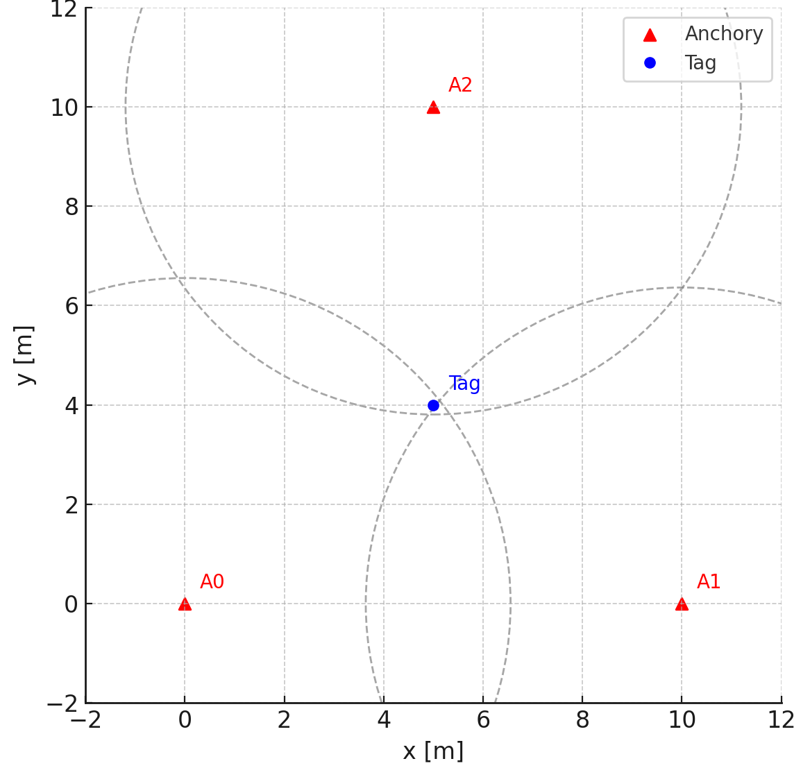

# Dílčí vypracovnání
[here](škola_info\README.md)
---

# 🛰️ Lokalizační systém na dvoupásovém vozidle pomocí ESP32, UWB a Wi-Fi

Tato ročníková práce představuje hybridní lokalizační systém postavený na platformě ESP32, který je integrován do dvoupásového robotického vozidla. Systém využívá **Ultra-Wideband (UWB)** pro přesné měření vzdáleností a **Wi-Fi fingerprinting** pro přibližnou lokalizaci. ESP32 zároveň umožňuje řízení vozidla nebo může fungovat jako samostatný **navigační modul** připojený přes Serial k jinému mikrokontroléru.

## ⚙️ Hlavní funkce

- 🚗 **Mobilní platforma:** ESP32 je umístěno na dvoupásovém vozidle a může jej samostatně ovládat.
- 🔁 **Modulární režim:** ESP32 lze přepnout do režimu **navigačního modulu** a komunikovat s jiným mikrokontrolérem přes sériovou linku.
- 📡 **UWB lokalizace:** Využívá se knihovna [`thotro/arduino-dw1000`](https://github.com/thotro/arduino-dw1000) pro přesné měření vzdáleností.
- 📶 **Wi-Fi fingerprinting:** ESP32 detekuje okolní Wi-Fi sítě a odhaduje polohu v neznámém prostředí.
- 🌐 **Webové rozhraní:** ESP32 hostuje jednoduchý web s informacemi o aktuální poloze.
- 🐍 **Python vizualizace:** V reálném čase je možné zobrazit pozici vozidla pomocí animace v Pythonu (`matplotlib`).
- 🔌 **Serial komunikace:** ESP32 odesílá výstupy polohy přes Serial — buď do počítače, nebo do jiného MCU.

## 📁 Struktura projektu

```
RP_Psutka_Slepicka/
├── PCB/                     # KiCad soubory pro návrh desky plošných spojů
├── modely/                  # 3D modely pro tisk
├── škola_info/              # Dílčí vypracování
├── docs/                    # Fotodokumentace
├── src/
│   ├── main/
│   │   ├── data/
│   │   │   ├── *.html       # Webové stránky hostované ESP32
│   │   │   └── *.json       # Hesla k Wi-Fi, uložené Wi-Fi fingerprinty
│   │   └── src/             # Zdrojový kód pro hlavní firmware ESP32
│   └── wifi-scan/           # ESP32 projekt pro sběr Wi-Fi fingerprintů
```

## 🧰 Použité technologie

- **ESP32-DevKitC v4**
- **DWM1000 UWB moduly**
- **PlatformIO + Arduino framework**
- **Python + matplotlib**
- **HTML + JavaScript (web na ESP32)**

## 🔧 Režimy provozu

### 🚘 Autonomní režim
ESP32 ovládá motorové jednotky vozidla a využívá lokalizaci pro navigaci.

### 🔗 Navigační modul
ESP32 funguje jako lokalizační jednotka připojená k jinému mikrokontroléru (např. další ESP32 nebo Arduino). Odhadovaná pozice je pravidelně posílána přes Serial.

## 💬 Komunikace po Serialu

Formát výstupu:
```
POS:[x,y] (2D) nebo POS:[x,y,z] (3D)
```

Možné rozšíření o příkazy pro změnu režimu, kalibraci, atd.

## 📸 Ukázky



## 📚 Zdroje

- [DW1000 datasheet](https://thetoolchain.com/mirror/dw1000/dw1000_user_manual_v2.05.pdf)
- [UWB localization – Wikipedia](https://en.wikipedia.org/wiki/Real-time_locating_system)
- [Arduino-DW1000 GitHub repo](https://github.com/thotro/arduino-dw1000)

## 📄 Licence

Projekt je vytvořen jako ročníková práce a není určen pro komerční použití.
